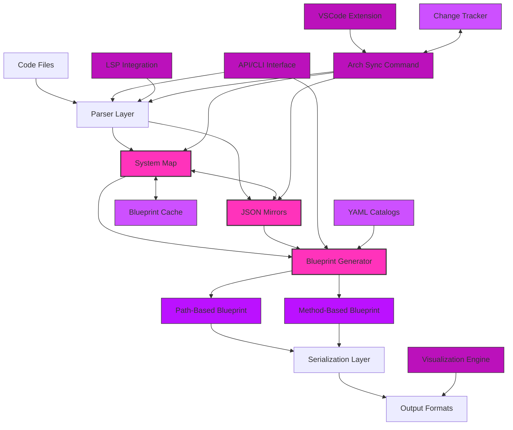
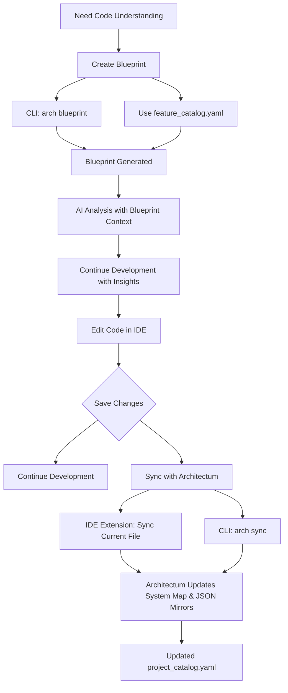
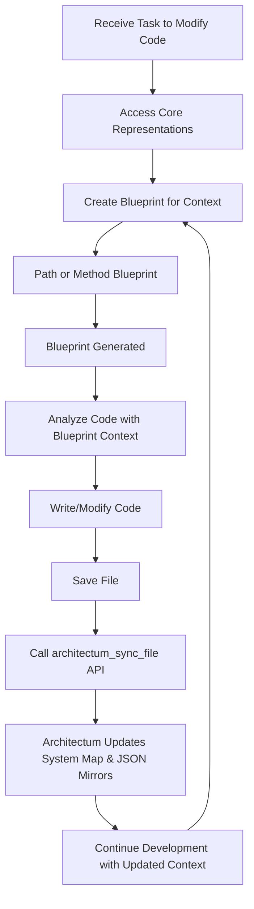

# Architectum Architecture Document

## 1. Architecture Overview

Architectum is a code comprehension system designed to transform codebases into navigable networks that serve both AI assistants and human developers. This document outlines the technical architecture of Architectum, focusing on its core components, data models, and interactions.

### 1.1 High-Level Architecture

Architectum employs a three-component architecture:
1. A **System Map** - A graph-based representation optimized for navigation and relationship discovery
2. **JSON Mirrors** - A parallel file structure that mirrors the original codebase with JSON representations of each file
3. **Blueprints** - Specialized views generated from the core representations for AI consumption



The architecture consists of:

1. **Parser Layer**: Extracts code structure and relationships from source files, optionally leveraging LSP
2. **System Map**: Represents code as a network of nodes and relationships, enabling navigation from any point
3. **JSON Mirrors**: Maintains a mirrored JSON representation of each file in the codebase
4. **Blueprint Generator**: Creates blueprints based on the core representations
5. **Blueprint Types**:
   - **Path-Based Blueprint**: Analyzes directory structures with configurable depth
   - **Method-Based Blueprint**: Focuses on specific methods (defaults to entire file if no methods specified)
6. **Serialization Layer**: Converts blueprints to various output formats
7. **API/CLI Interface**: Provides interaction points for users and other systems
8. **Blueprint Cache**: Stores generated blueprints for incremental updates
9. **LSP Integration**: Optional enhancement for more accurate relationship extraction
10. **Visualization Engine**: Renders graph-based blueprints for human consumption
11. **Arch Sync Command**: CLI tool and API for synchronizing code with Architectum representation
12. **VSCode Extension**: IDE integration for synchronizing files with Architectum
13. **Change Tracker**: Tracks which files need synchronization
14. **YAML Catalogs**: Two catalog files (`project_catalog.yaml` and `feature_catalog.yaml`) for tracking the codebase

### 1.2 Core Design Principles

Architectum's architecture is guided by the following principles:

- **Three-Component Core**: Code is represented through a System Map (for navigation), JSON Mirrors (for content), and Blueprints (for AI consumption)
- **Catalog-Based Tracking**: Use `project_catalog.yaml` for raw file inventory and `feature_catalog.yaml` for feature organization
- **Developer-Controlled Synchronization**: Developers explicitly control when to synchronize code with Architectum using the `arch sync` command
- **Incremental Processing**: Changes should only regenerate affected portions of representations
- **Format Flexibility**: Internal processing uses JSON but supports transformation to other formats
- **Extension Points**: Clear interfaces for adding new languages, blueprint types, and features

## 2. Core Components

### 2.1 JSON Mirrors

Architectum maintains JSON mirrors that represent each file in the codebase.

#### 2.1.1 Mirror Structure Model

```python
class JSONMirrors:
    """Manages the JSON mirror representation of code files."""
    
    root_path: str
    mirror_path: str
    
    def get_mirror_path(self, source_path: str) -> str:
        """Get the path of the mirrored JSON file for a source code file."""
        
    def get_mirrored_content(self, source_path: str) -> Optional[Dict[str, Any]]:
        """Get the JSON representation of a source code file."""
        
    def update_mirrored_content(self, source_path: str, content: Dict[str, Any]) -> None:
        """Update the JSON representation of a source code file."""
        
    def exists(self, source_path: str) -> bool:
        """Check if a mirrored file exists for the given source path."""

class FileContent:
    """Represents the content of a file."""
    
    path: str
    extension: str
    elements: Dict[str, CodeElement]
    imports: List[str]
    
    def to_json(self) -> Dict[str, Any]:
        """Convert the file content to a JSON representation."""

class DirectoryContent:
    """Represents the content of a directory."""
    
    path: str
    files: List[str]
    subdirectories: List[str]
    
    def to_json(self) -> Dict[str, Any]:
        """Convert the directory content to a JSON representation."""

class CodeElement:
    """Represents a code element (function, class, etc.)."""
    
    name: str
    type: ElementType
    line_start: int
    line_end: int
    metadata: Dict[str, Any]
    
    def to_json(self) -> Dict[str, Any]:
        """Convert the code element to a JSON representation."""
```

#### 2.1.2 JSON Mirror Example

```json
{
  "path": "src/services/user_service.py",
  "extension": ".py",
  "elements": {
    "UserService": {
      "name": "UserService",
      "type": "class",
      "line_start": 10,
      "line_end": 50,
      "methods": ["get_user", "update_user"],
      "properties": ["db_client"]
    },
    "get_user": {
      "name": "get_user",
      "type": "method",
      "line_start": 15,
      "line_end": 25,
      "parent": "UserService",
      "parameters": [{"name": "user_id", "type": "str"}],
      "return_type": "User"
    }
  },
  "imports": ["src/models/user.py", "src/database/client.py"]
}
```

#### 2.1.3 Directory Information Example

```json
{
  "path": "src/services",
  "files": ["user_service.py", "auth_service.py"],
  "subdirectories": ["utils"]
}
```

### 2.2 System Map

The System Map is the central component for navigation, representing code as a directed graph of nodes and relationships.

#### 2.2.1 Node Types

```python
class Node:
    """Base class for all nodes in the graph."""
    id: str
    type: NodeType
    metadata: Dict[str, Any]

class FileNode(Node):
    """Represents a file in the codebase."""
    path: str
    extension: str
    
class DirectoryNode(Node):
    """Represents a directory in the codebase."""
    path: str

class FunctionNode(Node):
    """Represents a function/method in the codebase."""
    name: str
    parameters: List[ParameterInfo]
    return_type: Optional[TypeInfo]
    line_start: int
    line_end: int

class ClassNode(Node):
    """Represents a class in the codebase."""
    name: str
    properties: List[PropertyInfo]
    line_start: int
    line_end: int

class FeatureNode(Node):
    """Represents a virtual feature grouping."""
    name: str
    description: str
```

#### 2.2.2 Relationship Types

```python
class Relationship:
    """Base class for all relationships in the graph."""
    source_id: str
    target_id: str
    type: RelationshipType
    metadata: Dict[str, Any]

class ContainsRelationship(Relationship):
    """Represents a containment relationship (directory contains file, file contains function)."""
    
class CallsRelationship(Relationship):
    """Represents a function call relationship."""
    line_number: Optional[int]
    
class ImportsRelationship(Relationship):
    """Represents a file import relationship."""
    
class InheritsRelationship(Relationship):
    """Represents a class inheritance relationship."""
    
class ImplementsRelationship(Relationship):
    """Represents a function implementing a feature."""
```

#### 2.2.3 Graph Operations

The Graph Model provides operations for:

- **Node and Relationship CRUD**: Create, read, update, and delete nodes and relationships
- **Traversal**: Navigate the graph structure in any direction
- **Filtering**: Select nodes and relationships based on criteria
- **Subgraph Extraction**: Create focused views for specific blueprint types
- **Serialization**: Convert to/from JSON representation
- **Caching**: Store and retrieve graph state

### 2.3 Parser Layer

The Parser Layer analyzes source code files to extract structural information and relationship data.

#### 2.3.1 Language-Specific Parsers

```python
class Parser:
    """Base interface for language-specific parsers."""
    
    def parse_file(self, file_path: str, detail_level: DetailLevel) -> Tuple[List[Node], FileContent]:
        """Parse a file and return extracted nodes and file content."""
        
    def detect_relationships(self, nodes: List[Node], detail_level: DetailLevel) -> List[Relationship]:
        """Detect relationships between nodes."""

class PythonParser(Parser):
    """Parser implementation for Python files."""
    
class JavaScriptParser(Parser):
    """Parser implementation for JavaScript/TypeScript files."""
```

#### 2.3.2 LSP Integration (Optional Enhancement)

```python
class LSPClient:
    """Client for communicating with language servers."""
    
    def connect_to_server(self, language: str) -> bool:
        """Connect to appropriate language server."""
        
    def get_document_symbols(self, file_path: str) -> Dict[str, Any]:
        """Get symbols from a document via LSP."""
        
    def get_call_hierarchy(self, position: Position) -> Dict[str, Any]:
        """Get call hierarchy for a position via LSP."""
```

### 2.4 Blueprint Types

Architectum generates specialized blueprint types based on the core representations.

#### 2.4.1 Blueprint Base Class

```python
class Blueprint:
    """Base class for all blueprint types."""
    
    system_map: SystemMap
    json_mirrors: JSONMirrors
    
    def to_json(self) -> Dict[str, Any]:
        """Convert blueprint to JSON representation."""
        
    def to_xml(self) -> str:
        """Convert blueprint to XML representation."""
```

#### 2.4.2 Path-Based Blueprint

```python
class PathBasedBlueprint(Blueprint):
    """Blueprint focusing on directory structures."""
    
    path: str
    depth: int  # 0 for all levels
    
    def generate(self) -> None:
        """Generate blueprint for the specified path with given depth."""
```

#### 2.4.3 Method-Based Blueprint

```python
class MethodBasedBlueprint(Blueprint):
    """Blueprint focusing on specific methods within files."""
    
    components: Dict[str, List[str]]  # Maps file paths to method names (empty list means entire file)
    
    def generate(self) -> None:
        """Generate blueprint for the specified methods."""
```

### 2.5 Catalog Files

Architectum uses two YAML catalog files to track the codebase.

#### 2.5.1 Project Catalog

```yaml
# project_catalog.yaml
- path: "src/utils/time.js"
  functions:
    - "formatDate"
    - "parseTimestamp"
  tracking:
    json_representation: false
    system_map_updated: false

- path: "src/models/user.js"
  classes:
    - "User"
    - "UserSettings"
  tracking:
    json_representation: false
    system_map_updated: false
```

#### 2.5.2 Feature Catalog

```yaml
# feature_catalog.yaml
- feature: "User Authentication"
  files:
    - path: "src/auth/login.js"
      functions:
        - "validateCredentials"
        - "createSession"
    - path: "src/models/user.js"
      classes:
        - "User"
        - "AuthenticationService"
          methods:
            - "verify"
            - "generateToken"

- feature: "Permissions System"
  files:
    - path: "src/auth/permissions.js"
      functions:
        - "canAccess"
        - "getUserPermissions"
    - path: "src/models/user.js"
      classes:
        - "User"
          methods:
            - "hasRole"
            - "getRoles"
```

### 3.1 Blueprint CLI Commands

```python
@click.group()
def cli():
    """Architectum CLI for code comprehension and AI assistance."""

@cli.group()
def blueprint():
    """Generate blueprints from code."""

@blueprint.command('path')
@click.argument('path', required=True)
@click.option('--depth', default=0, help='Depth to scan (0 for all)')
@click.option('--output', default='-', help='Output file (- for stdout)')
@click.option('--format', default='json', help='Output format')
def path_blueprint(path, depth, output, format):
    """Generate blueprint for a directory path."""
    
@blueprint.command('method')
@click.option('--file', '-f', multiple=True, required=True, help='Source file path')
@click.option('--method', '-m', multiple=True, help='Method name within file (omit for entire file)')
@click.option('--output', default='-', help='Output file (- for stdout)')
@click.option('--format', default='json', help='Output format')
def method_blueprint(file, method, output, format):
    """Generate blueprint for specific methods or entire files."""
```

### 3.2 Blueprint API Interface

```python
def create_path_blueprint(path: str, depth: int = 0, output_format: str = 'json') -> Union[Dict[str, Any], str]:
    """
    Create a path-based blueprint.
    
    Args:
        path: Directory path to analyze
        depth: Depth to scan (0 for all)
        output_format: Format to return (json, xml)
        
    Returns:
        Blueprint in the requested format
    """

def create_method_blueprint(components: Dict[str, List[str]], output_format: str = 'json') -> Union[Dict[str, Any], str]:
    """
    Create a method-based blueprint.
    
    Args:
        components: Dictionary mapping file paths to method names (empty list for entire file)
        output_format: Format to return (json, xml)
        
    Returns:
        Blueprint in the requested format
    """
```

## 4. Human and AI Workflows

### 4.1 Human Developer Workflow



### 4.2 AI Agent Workflow



## 5. Technical Implementation

### 5.1 Technology Stack

- **Primary Language**: Python 3.13
- **Graph Library**: NetworkX
- **CLI Framework**: Click
- **API Framework**: FastAPI
- **Serialization**: JSON (primary), XML (for AI consumption)
- **VSCode Extension**: TypeScript
- **Testing**: pytest, hypothesis, pact
- **Documentation**: Sphinx

### 5.2 Module Organization

```
architectum/
├── arch_blueprint_generator/
│   ├── __init__.py
│   ├── models/                   # Core data models
│   │   ├── __init__.py
│   │   ├── system_map.py        # System map model
│   │   ├── json_mirrors.py      # JSON mirrors model
│   │   └── nodes.py             # Node and relationship types
│   ├── parsers/                  # Code parsing
│   │   ├── __init__.py
│   │   ├── python_parser.py     # Python-specific parser
│   │   └── javascript_parser.py # JavaScript/TypeScript parser
│   ├── blueprints/               # Blueprint types
│   │   ├── __init__.py
│   │   ├── base.py              # Blueprint base class
│   │   ├── path_based.py        # Path-based blueprint
│   │   └── method_based.py      # Method-based blueprint
│   ├── navigation/               # Navigation components
│   │   ├── __init__.py
│   │   ├── file_navigator.py    # JSON mirror navigation
│   │   └── graph_navigator.py   # System map navigation
│   ├── yaml/                     # YAML processing
│   │   ├── __init__.py
│   │   ├── project_catalog.py   # Project catalog management
│   │   └── feature_catalog.py   # Feature catalog management
│   ├── formatters/               # Output formatting
│   │   ├── __init__.py
│   │   ├── json_formatter.py    # JSON output
│   │   └── xml_formatter.py     # XML output
│   ├── cache/                    # Caching system
│   │   ├── __init__.py
│   │   └── blueprint_cache.py   # Blueprint caching
│   ├── sync/                     # Synchronization components
│   │   ├── __init__.py
│   │   ├── arch_sync.py         # arch sync implementation
│   │   └── change_tracker.py    # Change tracking
│   ├── cli/                      # Command-line interface
│   │   ├── __init__.py
│   │   └── commands.py          # CLI commands
│   └── api/                      # API interface
│       ├── __init__.py
│       └── routes.py            # API endpoints
├── vscode-extension/            # VSCode extension
│   ├── src/                     # Extension source code
│   └── package.json             # Extension manifest
├── tests/                        # Testing
│   ├── unit/                     # Unit tests
│   ├── integration/              # Integration tests
│   ├── contracts/                # Contract tests
│   └── snapshots/                # Snapshot tests
└── docs/                         # Documentation
```

## 6. Extension Points

Architectum is designed for extensibility in key areas:

### 6.1 New Languages

New language support can be added by implementing the Parser interface:

```python
class SwiftParser(Parser):
    """Parser implementation for Swift files."""
    
    def parse_file(self, file_path: str) -> Tuple[List[Node], FileContent]:
        """Parse a Swift file and return extracted nodes and file content."""
        
    def detect_relationships(self, nodes: List[Node]) -> List[Relationship]:
        """Detect relationships between Swift nodes."""
```

### 6.2 New Blueprint Types

Additional blueprint types can be created by extending the Blueprint base class:

```python
class CustomBlueprint(Blueprint):
    """Custom blueprint for specific needs."""
    
    def generate(self) -> None:
        """Generate the custom blueprint."""
```

### 6.3 New Output Formats

Support for new output formats can be added by implementing the OutputFormatter interface:

```python
class GraphMLFormatter(OutputFormatter):
    """Format blueprint as GraphML for visualization tools."""
    
    def format(self, blueprint: Blueprint) -> str:
        """Format blueprint as GraphML."""
```

## 7. Future Enhancements

### 7.1 Enhanced LSP Integration

- Deeper integration with Language Server Protocol
- Real-time updates as code is edited
- More accurate relationship detection

### 7.2 Git Integration

- Post-commit hooks for automatic synchronization
- Branch-aware blueprint generation
- Diff-based incremental updates

### 7.3 Props Tracking

- Track component property flow across React/Vue components
- Identify prop origins and prop usage
- Visualize prop flow in the System Map

### 7.4 Advanced Feature Tagging

- AI-assisted feature boundary detection
- Automatic tagging based on naming conventions
- Feature tag propagation through relationships

### 7.5 Interactive Visualization

- Web-based graph visualization
- Interactive navigation through the codebase
- Custom views and filtering

## Change Log

| Change        | Date       | Version | Description                    | Author         |
| ------------- | ---------- | ------- | ------------------------------ | -------------- |
| Initial draft | 05-17-2025 | 0.1     | Initial architecture document  | System Architect |
| Update        | 05-17-2025 | 0.2     | Added arch sync workflow       | System Architect |
| Revision      | 05-17-2025 | 0.3     | Refined blueprint types and core representations | System Architect |
| Update        | 05-21-2025 | 0.4     | Updated to simplified architecture with two blueprint types and catalog system | Claude 3.7 Sonnet |