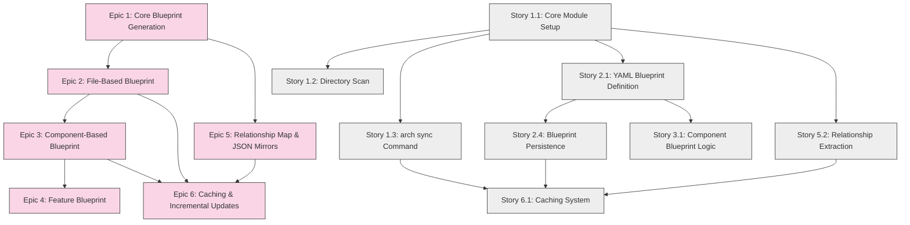

# Story Dependencies and Testing Requirements

## Story Dependency Structure

Each story in all epics should clearly indicate its dependencies using the following format:

```markdown
### Story X.Y: [Story Title]

- **User Story / Goal:** [Description]
- **Dependencies:**
  - [Specific story or component that must be completed first]
  - [Required framework or utility that must be in place]
  - [Any cross-epic dependencies]
- **Detailed Requirements:**
  [Original content continues here]
```

## Test Coverage Gate

- **Mandatory Requirement**: Each story must achieve at least 80% test coverage before being considered complete and ready for the next story to begin.
- **Coverage Measurement**: Use pytest-cov to measure code coverage with the command `pytest --cov=arch_blueprint_generator tests/`
- **Coverage Report**: A coverage report must be generated and reviewed as part of each story's completion process.
- **Exemptions**: If a specific component cannot reasonably achieve 80% coverage, document the reason and get explicit approval before proceeding.

## Epic 6: Cross-Epic Dependencies Matrix

For Epic 6 (Caching and Incremental Updates), the following cross-epic dependencies must be satisfied:

| Dependency | Required For | Status |
|------------|--------------|--------|
| Epic 1: Core Blueprint Generation | Base functionality for caching | Required |
| Epic 1: Story 1.3 (arch sync command) | Synchronization foundation | Required |
| Epic 2: Story 2.1 (YAML-Based Blueprint Definition) | Blueprint definition storage | Required |
| Epic 2: Story 2.4 (Blueprint Persistence) | Storage mechanism for caching | Required |
| Epic 3: Story 3.1 (Component-Based Blueprint Logic) | Component-level incremental updates | Required |
| Epic 5: Story 5.2 (Relationship Extraction) | Relationship caching | Required |

## Visual Dependency Graph



This document should be used as a reference when planning implementation and reviewing story readiness. All stories should update their status in the relevant dependency matrices as they are completed.
